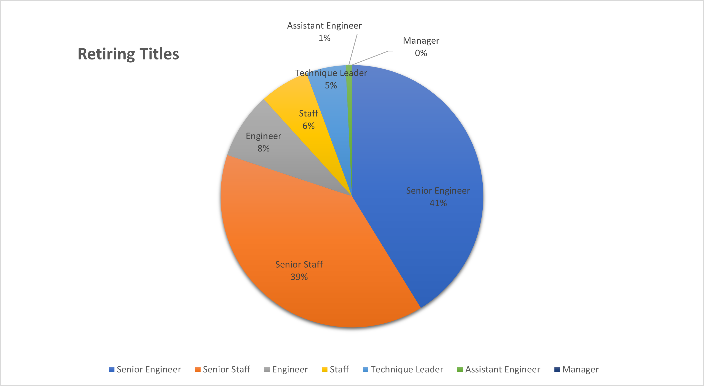

# Plan for Retirement Analysis

## Overview

### Purpose
Using pgAdmin and PostgresSQL to organize employee data in a way to best analyze and prepare for the upcoming wave of retirements within Pewlett-Hackard.

### Insight
This is a flow chart that indicates the order of current employee data via .csv files.

## Analysis Results
- Determine the number of retiring employees per title 

- Identify employees who are eligible to participate in a mentorship program. 
  - Born in 1965 and have current roles with no termination date.
  - Constructed a data file that consist of employees eligible to mentor new employees.

- Not many managers are retiring: no managers are eligible under these criteria.

- Senior staff transitions will make up about 50% of the process.

## Conclusion
I do believe this is a good approach to the mentorship program. Further analysis with additional criteria parameters will help new employee to mentor ratios and increase success. Over 90, 000 will be retiring and only 1,500 are eligible mentors. Offering mentors financial incentives to participate in this program can improve outcomes. If the program is received as just an additional responsibility it maybe neglected or implemented poorly.

